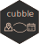

<!-- README.md is generated from README.Rmd. Please edit that file -->

```{r, include = FALSE}
knitr::opts_chunk$set(
  collapse = TRUE,
  comment = "#>",
  fig.path = "man/figures/README-",
  out.width = "100%",
  message = FALSE
)
```

# cubble <a href='https://huizezhang-sherry.github.io/cubble/'></a>

<!-- badges: start -->
[](https://github.com/huizezhang-sherry/cubble/actions)
<!-- badges: end -->

Cubble provides a new data structure to manipulate spatio-temporal vector data. It arranges variables into two forms: nested form and long form. The nested form shows each site in a row and time invariant variables as columns. The time varying variables are nested into a `ts` column. In the long form, each row is cross-identified by the site and time, time varying variables are presented, and time invariant variables are stored as an attribute. The two forms can be switched back and forth for manipulation on the spatial and temporal dimension of the data. 

## Installation

You can install the released version of cubble from [CRAN](https://CRAN.R-project.org) with:

``` r
install.packages("cubble")
```

And the development version from [GitHub](https://github.com/) with:

``` r
# install.packages("remotes")
remotes::install_github("huizezhang-sherry/cubble")
```
## Example

`as_cubble()` creates a cubble in the nested form by supplying the spatial identifier, `key`, temporal identifier, `index`, and the spatial coordinates that defines the site, `coords`.

```{r}
library(cubble)
library(dplyr)
nested <- climate_flat |> 
  as_cubble(key = id, index = date, coords = c(long, lat))
nested
```

`face_temporal()` switches a cubble from the nested form to the long form. The long form cubble is for operations whose output is cross-identified by `key` and `index`, for example, filtering January records:

```{r}
long <- nested |> 
  face_temporal() |> 
  filter(lubridate::month(date) == 1)
long
```

`face_spatial()` switches the long cubble back to the nested cubble. The nested form is for operations whose output is only identified by the `key`, for example, mutating the average maximum temperature in January:

```{r}
long |> 
  face_spatial() |> 
  mutate(avg_max = mean(ts$tmax, na.rm = TRUE))
```


## Misc

- **Naming**: Cubble stands for "cubical tibble" and you can think of multivariate spatio-temporal data as a *cube* with three axes: variable, location, and time. 
