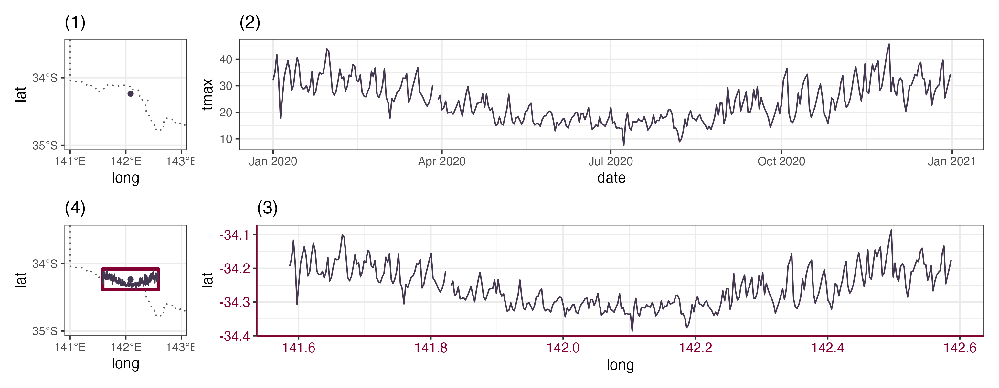

```{r, include = FALSE}
knitr::opts_chunk$set(
  collapse = TRUE,
  comment = "#>",
  message = FALSE, 
  warning = FALSE,
  out.width = "100%"
)
```

```{r setup, echo = FALSE}
library(dplyr)
library(cubble)
library(ggplot2)
library(tsibble)
```

Sometimes, we wish to communicate spatial and temporal information collectively through visualisation. This can be achieved through several graphical displays: one can make faceted maps across time, creating map animations, or constructing interactive graphics to link between map and time series plot. While interactive graphics will be the main focus of vignette [6. Interactive graphics](https://huizezhang-sherry.github.io/cubble/articles/cb6interactive.html), this vignette will introduce a specific type of spatio-temporal plot called glyph maps.


# Understanding glyph maps

The concept of glyph maps was initially proposed in @Wickham2012-yr. The underlying idea is to transform the temporal coordinates into spatial coordinates so that time series plot can be displayed on the map. The diagram below illustrates how the coordinate transformation:

```{r echo = FALSE}

```

Subplot (1) show the spatial location of a weather station and subplot (2) displays its associated maximum temperature as time series in 2020. In subplot (3), the temporal coordinates are transformed into the spatial coordinates using linear algebra with a defined `height` and `width` (Equation 1 in @Wickham2012-yr), while the time series glyph remains unchanged. The transformed time series can then be plotted as a layer on the map in (4). 

The package `GGally` initially implement the glyph map. It uses `glyphs()` to calculate the axis transformation and then uses `geom_polygon()` to draw the map. In cubble, a ggproto implementation `geom_glyph()` performs the linear algebra internally as data transformation . The `geom_glyph()` requires four aesthetics: `x_major`, `y_major`, `x_minor`, and `y_minor`. The major axes are the outer spatial coordinates and the minor axes are the inner/ temporal coordinates: 

```
data |> 
  ggplot() +
  geom_glyph(aes(x_major = ..., x_minor = ..., y_major = ..., y_minor = ...))
```

Reference line and box can be added by separate geoms (`geom_glyph_box()`, `geom_glyph_line()`) with the same aesthetics (`x_major, x_minor, y_major, y_minor`). To avoid repetition, you may want specify the aesthetics collectively inside `ggplot()`:

```
data |> 
  ggplot(aes(x_major = ..., x_minor = ..., y_major = ..., y_minor = ...)) +
  geom_glyph_box() + 
  geom_glyph_line() + 
  geom_glyph()
```

If you want add an undelying map which does not use the four glyph map aesthetics, the argument `inherit.aes = FALSE` is handy: 

```
data |> 
  ggplot(aes(x_major = ..., x_minor = ..., y_major = ..., y_minor = ...)) +
  geom_sf(data = MAP_DATA, inherit.aes = FALSE)
  geom_glyph_box() + 
  geom_glyph_line() + 
  geom_glyph()
```

# Monthly average maximum temperature in Victoria, Australia

Global Historical Climatology Network (GHCN) provides daily climate measures from stations across the world. The dataset `climate_aus` stores climate variables (precipitation, maximum and minimum temperature) for `r nrow(climate_aus)` Australian stations in 2020. This is a lot of stations to work with and we will start with a randomly sample 80 stations (since not all the stations have the full year record, we will only consider those that have 366 days for 2020): 

```{r}
set.seed(12345)
(tmax <- climate_aus |> 
    rowwise() |> 
    filter(nrow(ts) == 366) |> 
    slice_sample(n = 80))
```

Next, we would like to summarise the daily maximum temperature into monthly. This can be done with the dplyr `group_by` + `summarise`:

```{r}
(tmax <- tmax |> 
  face_temporal() |> 
  group_by(month = tsibble::yearmonth(date)) |> 
  summarise(tmax = mean(tmax, na.rm = TRUE)))
```

One requirement for the data to be plot with ggplot2 is that all the variables mapped to aesthetics need to be store in the same table. In cubble, you can move the spatial variables (e.g. `long` and `lat`) into the temporal cubble with `unfold()`:

```{r}
(tmax <- tmax |> unfold(long, lat))
```

Using the glyph map syntax introduced in this vignette, we can then create a glyph map: 

```{r}
tmax |> 
  ggplot(aes(x_major = long, y_major = lat, 
             x_minor = month, y_minor = tmax))  + 
  geom_sf(data = ozmaps::abs_ste, 
          fill = "grey95", color = "white",
          inherit.aes = FALSE) + 
  geom_glyph_box(width = 1, height = 0.5) + 
  geom_glyph(width = 1,  height = 0.5) + 
  coord_sf(xlim = c(110, 155)) + 
  theme_void() + 
  theme(legend.position = "bottom") + 
  labs(x = "Longitude", y = "Latitude")
```

```{r eval = FALSE, echo = FALSE}
# script for diagram 
library(tidyverse)
library(ggsvg)
library(patchwork)
nsw <- ozmaps::abs_ste |> 
  filter(NAME %in% c("New South Wales")) |> 
  sf::st_simplify(dTolerance = 4000)

single <- climate_aus |> filter(id == "ASN00076031")
glyph_dt <- single |> face_temporal() |> unfold(long, lat)
p1 <- ggplot() + 
  geom_sf(data = nsw,fill = "transparent", linetype = "dotted")+ 
  geom_point(data = single, aes(x = long, y = lat), color = "#443750") + 
  theme_bw() + 
  coord_sf(xlim = c(141, 143), ylim = c(-35, -33.5)) + 
  scale_x_continuous(breaks = seq(140, 143, 1)) + 
  scale_y_continuous(breaks = seq(-35, -33, 1)) + 
  ggtitle("(1)")

p2 <- single |> 
  face_temporal() |> 
  ggplot(aes(x = date, y = tmax)) + 
  geom_line(color = "#443750") + 
  theme_bw() + 
  theme() + 
  ggtitle("(2)")

glyph <- glyph_dt |> 
  ggplot(aes(x_major = long, x_minor = as.numeric(date),
             y_major = lat, y_minor = tmax)) + 
  geom_glyph(width = 1, height = 0.3)

p3 <- layer_data(glyph) |> 
  ggplot(aes(x = x, y = y)) + 
  geom_line(color = "#443750") +
  theme_bw() + 
  theme(axis.line = element_line(color = "#840032"),
        axis.text = element_text(color = "#840032", size = 10),
  ) + 
  ggtitle("(3)") + xlab("long") + ylab("lat")

p4 <- glyph_dt |> 
  ggplot(aes(x_major = long, x_minor = as.numeric(date),
             y_major = lat, y_minor = tmax)) + 
  geom_sf(data = nsw, fill = "transparent", 
          linetype = "dotted", inherit.aes = FALSE) + 
  geom_glyph_box(width = 1, height = 0.3, color= "#840032", size = 1.2) + 
  geom_glyph(color = "#443750", width = 1, height = 0.3) + 
  geom_point(data = single, aes(x = long, y = lat), 
             color = "#443750", inherit.aes = FALSE) + 
  theme_bw() + 
  coord_sf(xlim = c(141, 143), ylim = c(-35, -33.5)) + 
  scale_x_continuous(breaks = seq(140, 143, 1)) + 
  scale_y_continuous(breaks = seq(-35, -33, 1)) + 
  ggtitle("(4)") + xlab("long") + ylab("lat")

g2 <- (p1 | p2) / (p4 | p3) + plot_layout(guides='collect') &
  theme(legend.position='none')

ggsave(g2, 
       filename = here::here("vignettes/cluster-diagram/glyph-steps.png"), 
       height = 4)
```


# Reference
