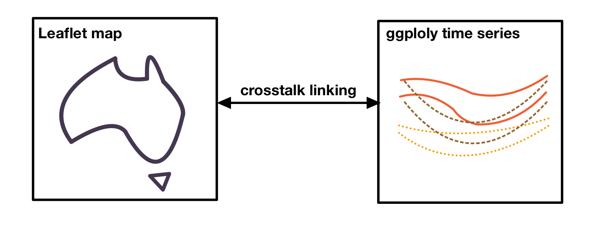
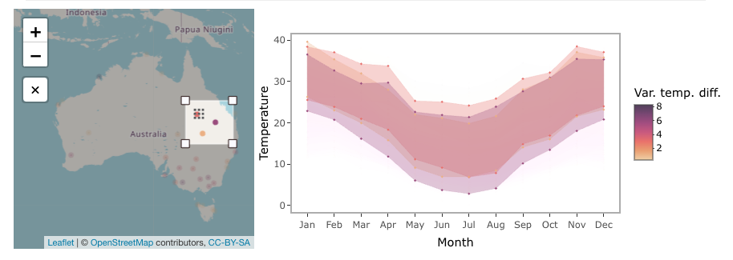

```{r, include = FALSE}
knitr::opts_chunk$set(
  collapse = TRUE,
  comment = "#>", 
  warning = FALSE,
  message = FALSE,
  fig.align = "center"
)

library(cubble)
library(dplyr)
library(ggplot2)
library(leaflet)
library(crosstalk)
library(plotly)
```

Interactive graphics can be useful when working with spatio-temporal data since they allow for exploring the data from multiple perspective. In this vignette, we will demonstrate how to create an interactive graphic with cubble objects. We will be using `crosstalk::bscols()` to create a linked interactive plot of an Australia map, created with leaflet, and a ggplot plotly time series plot: 

```{r echo = FALSE}

```


This vignette assumes you have gone through [Get started](cubble.html) and are familiar with basic data wrangling in cubble with `face_temporal()` and `face_spatial()`. 

# Variation of diurnal temperature range in Australia

Australia has diverse climate conditions with different temperature patterns across its regions. and different temperature patterns can be observed. We can compute the average maximum and minimum temperature by month at 30 locations sampled from the dataset `climate_aus`. The diurnal temperature range, the difference between the maximum and minimum temperature, has different variations throughout the year. We will use its variance to color the plot. The codes below calculate these variables: 

```{r}
set.seed(123)
climate_smaller <- climate_aus |> head(n = 30) 
(clean <- climate_smaller |>
  face_temporal() |>
  group_by(month = lubridate::month(date, label = TRUE, abbr = TRUE)) |>
  summarise(
    tmax = mean(tmax, na.rm = TRUE),
    tmin = mean(tmin, na.rm = TRUE),
    diff = mean(tmax - tmin, na.rm = TRUE)
    ) |>
    face_spatial() |>
    rowwise() |> 
    mutate(temp_diff_var = var(ts$diff, na.rm = TRUE))
)

```

# Linking with crosstalk

We create two SharedData objects in crosstalk - one using the nested cubble and another using the long cubble. We will use the `id` as the key and give them the same group name (`group = "cubble"`):

```{r}
nested <- clean %>% SharedData$new(~id, group = "cubble")
long <- clean |>
  face_temporal() |>
  unfold(temp_diff_var) |>
  arrange(temp_diff_var) %>% 
  SharedData$new(~id, group = "cubble")
```

# Creating maps with leaflet

To create a basic leaflet map showing station location, we can use `addTiles()` to  create an underlying map and `addCircleMarkers()` to add points representing the stations:

```
leaflet(nested, width = 300, height = 300) |>
  addTiles() |>
  addCircleMarkers()
```

To apply colors to the stations, we need to map a variable in the data to a color palette. In this example, we map the numerical variable `temp_diff_var` to a sequential color palette, Rocket, with some color fine-tuning using `colorNumeric()`. We also add a popup to display the station names using the `popup` argument in `addCircleMarkers()`:

```{r}
domain <- clean$temp_diff_var
pal <- colorNumeric(
  colorspace::sequential_hcl(
    "Rocket",  n = 7, cmax = 90, rev = TRUE, c2 = 40, l2= 85, c1 = 20, l1 = 30),
  domain = domain)

map <- leaflet(nested, width = 300, height = 300) |>
  addTiles() |>
  addCircleMarkers(color = ~pal(domain), group = "a", radius = 0.1,
                   popup = ~name, fillOpacity = 1, opacity = 1)
```


# Creating time series plot with plotly

The time series plot allows us to visualize the temperature band of each station, providing insights into the diurnal temperature range by month. We can use geom_ribbon() to create a temperature band that displays both the maximum and minimum temperature:

```{r}
ts_static <- long %>% 
  ggplot(aes(x = month, group = id,
         fill = temp_diff_var, color = temp_diff_var
         )) +
  geom_ribbon(aes(ymin = tmin, ymax = tmax), size = 0.1, alpha = 0.3) +
  # geom_point(aes(y = tmax), size = 0.1) +
  # geom_point(aes(y = tmin), size = 0.1) +
  colorspace::scale_fill_continuous_sequential(
    "Rocket",  n_interp = 7, cmax = 90, rev = TRUE,
    c2 = 40, l2= 85, c1 = 20, l1 = 30, name = "Var. temp. diff.") +
  colorspace::scale_colour_continuous_sequential(
    "Rocket",  n_interp = 7, cmax = 90, rev = TRUE,
    c2 = 40, l2= 85, c1 = 20, l1 = 30, name = "Var. temp. diff.") +
  labs(x = "Month", y = "Temperature") +
  theme_bw() +
  theme(
    panel.grid.major = element_blank(),
    legend.position = "bottom"
    )
```

The static ggplot object can be converted into a plotly object using `ggplotly()` and `plotly::highlight()` enable the box or lasso selection (`on = "plotly_selected"`):

```{r}
ts_interactive <- ggplotly(ts_static, width = 600, height = 300) %>% 
    highlight(on = "plotly_selected", opacityDim = 0.012)
```


# Assembling into a linked plot

`crosstalk::bscols()` combines multiple interactive graphics in columns:

```{r eval = FALSE}
bscols(map, ts_interactive, widths = c(4, 6))
```

Below is a screenshot of the full graphics:

```{r echo = FALSE, out.width="150%"}
knitr::include_graphics("cluster-diagram/interactive-full.png")
```

# Making selection to see the linking

The selection in the linked plot works in both directions. In the screenshot below, a lasso selection is made on the time series, linking to the Cygnet Bay on the northwest coastline of Australia. In July, this area shows a larger temperature range compared to the summer period (December - February).

```{r echo = FALSE, out.width="150%"}
knitr::include_graphics("cluster-diagram/selection1.png")
```

Selection on the leaflet map can be made using the selection tool below the zoom-in/out bottom on the map. In the screenshot, two selections are made - one on northern Australia and the other in inland Queensland. Northern Australia has a narrow temperature range constantly 20 degrees throughout the year, while inland Queensland temperature has a much larger temperature range with a noticable difference between the summer and winter periods.

```{r echo = FALSE, out.width="150%"}
knitr::include_graphics("cluster-diagram/selection2.png")
```

```{r echo = FALSE, out.width="150%"}

```

Now it is your time to view the tooltip on the map and use the selection to explore weather patterns in Australia! 
