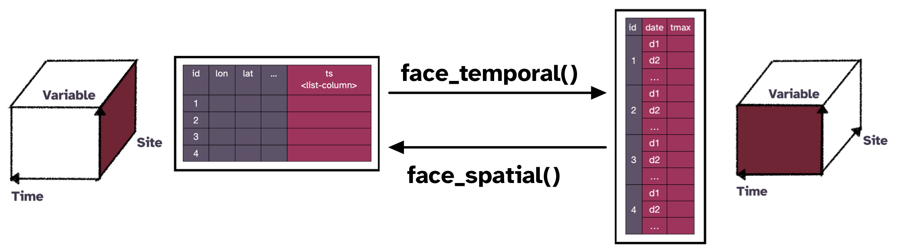

```{r, include = FALSE}
knitr::opts_chunk$set(
  collapse = TRUE,
  comment = "#>",
  warning = FALSE, 
  message = FALSE
)
```

```{r setup, echo = FALSE}
library(cubble)
library(dplyr)
```

This vignette provides some details on the `cubble_df` class. Here is a diagram that summarises the attributes associated with a nested and long cubble:

```{r echo = FALSE, fig.align='center'}
knitr::include_graphics("cluster-diagram/cubble-design.png")
```

Here the attributes can be divided into four categories:
  
  - `class`, `row.names`, `names` are attributes inherited from a `tibble` class,
  - `groups` is inherited from `rowwise_df` or `grouped_df` a nested or long cubble is built,
  - `index`, `coords`, and `form` are `cubble` specific attributes, and
  - `spatial` is a special attribute that only the long cubble has
  
Now we look into these attributes through two examples, one for nested cubble and one for long cubble:

# Nested cubble

A nested cubble is built on top of a `rowwise_df`, which comes with the `groups` attributes, as well as the usual `names`, `row.names`, and `class`. Note that the `class` attribute contains the history class that a `rowwise_df` is built upon: `tbl_df`, `tbl` and `data.frame`. This is an example of the attributes for a nested cubble: 

```{r}
climate_mel
attributes(climate_mel)
```

In this example, four stations are recorded at four time points: 1st to 4th Jan 2020. The `key` specified is mapped to the `groups` while `index` and `coords` are stored as the variable name in a cubble. This attribute will be the same as `key` most of the time but a useful piece of information to record later in the hierarchical data structure.

The `rowwise_df` class uses a `group` attribute to ensure each row is in its own group and this structure makes it simpler to calculate on the list. For example calculating the number of non-raining day can be done by: 

```{r}
climate_mel %>%  
  mutate(rain = sum(ts$prcp != 0, na.rm = TRUE))
```

which matches the basic mutate style of calculation, so it is easier to remember than the `purrr` style syntax: 

```{r}
climate_small %>%  
  tidyr::nest(c(date, prcp, tmax, tmin)) %>%  
  mutate(rain = purrr::map_dbl(data, ~sum(.x$prcp != 0, na.rm= TRUE)))
```

# Long cubble

A long form cubble is built from the `grouped_df` class where observations from the same site forms a group. Below prints a long cubble along with its attributes:

```{r}
long <- climate_mel %>%  face_temporal()
long
attributes(long)
```

The `spatial` attribute records the time-invariant variables in the data, so that when switch back to the nested form, these variables won't get lost. 

# Switching between the nested and long cubble

```{r echo = FALSE, fig.align='center'}

```

# Access cubble attributes

Apart from the usual `%@%` or `attr(DATA, "ATTRIBUTE")` to extract class attributes, cubble provides functions with the corresponding attribute name for easier extraction: `index()`, `key_vars()`, `key_data()`, `coords()`, and `spatial()` can be used to extract the relevant component in both forms:

```{r}
key_vars(long)
key_data(long)
spatial(long)
```
